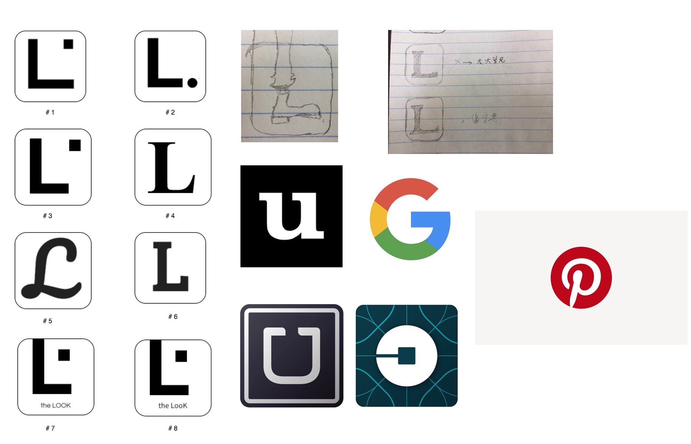

# THE LOOK

 > _Note:_ This document is meant to be written during (or shortly after) your initial planning meeting.     
 > It does not really make sense for you to edit this document much (if at all) while working on the project - Instead, at the end of the planning phase, you can refer back to this document and decide which parts of your plan you are happy with and which parts you would like to change.

## Iteration 02

 * Start date: October 24, 2017
 * End date: November 12, 2017

## Process

UI team starts to write UI. Backend just initialized, so we did not actually have any valid functionality. We decide to build a frame of UI that is enough for making video, displaying functionality, then after backend follows up, we will replace those decoys with real functionalities.

Backend team starts to build backend, design of database and tag system should be completed.

#### Roles & responsibilities

#####  

##### Front-end (Heng Ye, Xi Yan and Zezhong Pan):
 > Front-end team will be responsible for UI design, implementation and video making.
 
 * Zezhong Pan and Xi Yan are full stack developers with experience on front end implementation, Heng Ye took UI design course and has experience on GUI implementation, also his role of product manager has responsibility on user experience. So we decide they will be the UI team.

 * Zezhong is a video maker on Bilibili.com, he has a fully equipped home studio and tons of experience on making videos, he is the video guy. Heng Ye is the product manager, the video is about the app itself, so Heng knows better than the rest of the group on what we should present to the public about this app, he is the idea guy. Xi Yan in the UI team writes the main logic, so she will be needed when comes to the part on showing how to use the app.

##### Back-end (Dishu Lyu, Yuanhao Tu, Yiran Wang and Bin Yu): 
 > Back-end team will not participate in video making, they will concentrate on backend design and implementation.
 
 * Dishu Lyu is a full stack developer, he has experience on both backend and frontend, so he will be the leader of backend team, his front end experience also helps when communicate with front end team.

 * Yu Bin has experience on machine learning, on the previous meetings we had already seen his expertise and passion on machine learning and algorithm.

#### Events

Describe meetings (and other events) you are planning to have:

  * October 31, 2017 - In-person Meeting
On October 31, we were all busy for different midterms, so we made this meeting as not compulsory, and this meeting is only a reminder that we have to get started on D2. 

  * November 7, 2017 - Online Meeting
On November 7, due to it is in reading week and not much members are around school, so we made it an online meeting, and it’s a quite productive one.  We made most decisions about d2, we assigned roles and responsibilities, discussed detailed implementation on how to suggest clothes to user, include some machine learning solution that can be applied. We also browsed apps and websites that related to our backend implementation to get some inspiration.

#### Artifacts

List/describe the artifacts you will produce in order to organize your team.       

 * [Trackboard:](https://docs.google.com/document/d/1FIVt9HOjWtJEGN-1Ru8d8Crb7CeDV5ArKOWB1BIJYXE/edit)
     But not much in there because we are all more comfortable with WeChat Group Chat. The WeChat Group chat history is better at maintaining our tasks and schedules. 
 
 * How do we keep track of what needs to get done?
 
    We decided what needed to get done in the 7 Nov meeting, all details are in roles and responsibilities. 
 
 * How do you prioritize tasks?
 
    We had four remaining things that needs to get done for the entire project: documents, UI, Backend and the Video.
    
    We decide to put video on the top of the list, due to video is the main thing that is going to be marked on D2, so we should put more concentration to it.
    
    Backend implementation can be tough, and D3 is when all big dues(think about csc369 A4, write a file system from nothing) lines up, so we also decide to not put the entire team on UI and video. Backend guys will keep working on backend and will not be interfered by D2, their sole goal is to put backend online and working on D3. 
    
    Front end implementation will concentrate on make a “decoy version” instead of a real working front end due to back end is not finished, but we guarantee to fix that by D3.
    

 * How do tasks get assigned to team members?
 
    TODO

#### Git / GitHub workflow

Describe your Git / GitHub workflow.     
Essentially, we want to understand how your team members share a codebase and avoid conflicts.

 * Be concise, yet precise.      
For example, "we use pull-requests" is not a precise statement since it leaves too many open questions - Pull-requests from where to where? Who reviews the pull-requests? Who is responsible for merging them? etc.
 * If applicable, specify any naming conventions or standards you decide to adopt.
 * Don't forget to **explain why** you chose this workflow.

## Product

#### Goals and tasks

 * Describe your goals for this iteration and the tasks that you will have to complete in order to achieve these goals.
 * Order the items from most to least important.
 * Feel free (but not obligated) to specify some/all tasks as user stories.

We will concentrate on the video making, the video will be shown to investors and the public. It will need a UI that
 seems works and an excellent script that really displaying what this app does and how to use it well.

#### Artifacts

List/describe the artifacts you will produce in order to present your project idea.

 1. **Logo Design**.
  
    A logo is significant to a company or a product, it is the first and the only impression that is going
    to leave in user's mind, that is why we are so careful when comes to logo design. We have developed 9 different logos
    for the icon of the app, I will explain one by one about each's pro and cons.
    
 
    All logos are derived from the capital letter L, this design pattern follows from most popular application icon
    design, such as Google’s G, Uber’s U, Pinterest’s p and Uncrate’s u. We plan to combine the “The Look” text
    with its function, men style, like the way pinterest did: p and the pin.
    
    `#0`, the foot, derived from the leg of the main character of Cowboy Bebop, Spike Spiegel. The foot is just
    impossible to make a modern, elegant logo, so we give up on that, but it is an interesting thought.
    
    `#4` and `#6` are the original thoughts, but there are some problems within it: `#4`, report from online gamers in
    our group, looks way too similar to the logo of League of Legends and there is no way to fix it, that is how Times
    New Roman looks. And it also looks more like a logo for dictionary applications, due to most paperback dictionary
    uses Times New Roman.

    The font of `#6` looks like it is an initial for a university, and it gives the wrong feelings--too tough,
     too square, lack of elegance, and too student. Same problem with `#5`.

    Then we have `#2`, an image copy from internet. Helvetica with bold effect looks like the way to go, but still
     something wrong with it: the dot means nothing to us, but if we take the dot out, then it’s too empty on the
      upper-right corner.

    So we decide to move the dot to the upper-right corner to see what will that looks like, here goes `#1`. It actually
     looks not bad, and somehow it looks like men’s cuff, which is a surprise to us: both “L” and the
      functionality--men’s style are included, I think we did a better job then Pinterest on this. But there is
       still something unsatisfied: the shape of L makes it doesn’t looks like an L,and the way the L and the dot
        occupies the icon is just too dull, nothing interesting in there. So we change the shape of L
        (from vertical:horizontal 4:4 to vertical:horizontal 4:3)--`#3`, but then the dot seems out of place, 
        and the left-lower corner looks void now. So we figure, why not make the logo a part of the icon to avoid 
        the emptiness? So we move the logo up and add text to the bottom, that is `#7` and `#8`, text at the bottom,
         men’s cuff on the upper. `#7`’s text’s font’s L looks more like 4:4, so we eventually move to `#8`.

 1. **Product Functionality added: Cart and Checkout function**

    We did some critical thinking on the function of the app on should the app solely focus on suggesting user product
     and provide the link for purchase, or should the app have a direct way to purchase, eventually we decide to make
      the app have a cart and checkout function. 

    It doesn’t make sense at first sight, due to only do the style suggesting would be a lot easier, and make more
     sense for a startup, otherwise there will be problems on stock. But we think this is actually crucial to user
      experience.

    If user is interested in a style and he want to make a purchase, if the app can only provide links to products
    , shirt comes from Nike,pants comes from Levis and shoes comes from Adidas, then user has to jump back-and-forth
     between The Look and browser three times, and he has to manually input his billing address and credit card 
     payment method three times, which is pretty bad user experience, and did not make the user buy style easier,
      so we decide to avoid that, and add a checkout function to the app.

 1. **Change of product mandate**

    Our original product mandate is to help men with no style shopping clothes, now, with the app coming true, and me more realizing what this app provides to its user, I think we can do more than just that. 

    I decide to change the mandate of the app to “help all men shopping clothes”. 
    
    In Chinese dictionary, there are two ways to locate a word. One is by alphabetic order, A for Armani, B for balmin, H for H&M.etc, that’s how we shop in a ordinary mall, or shop cloth online, we go to one store(or its website), then another.
    
    Another way is to look up a word by its structure. If I have to explain it in English, image there is a chart in your Marin-Webster that contains all words start with a prefix ”pre”, and another chart contains all words end with suffix ”ness”. When you want a specific style of word, a specific suffix or prefix, you just go to the chart, and you will know all about it. This is the shopping experience that The Look is providing, locate a specific style first, then you can see all the clothes that can be a part of that style. It is a new way to shopping for men, more straight, more determinant, and more direct.
    
    After all, what customers are buying is NOT a specific cloth, but a general look, which is the value added part that we provide.

 1. **On the customer profile page, is it a better idea to put an avatar system?**

